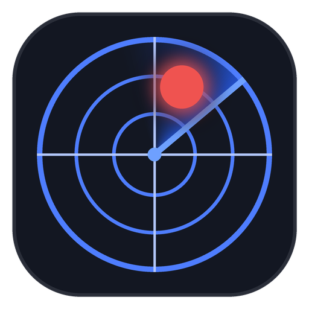
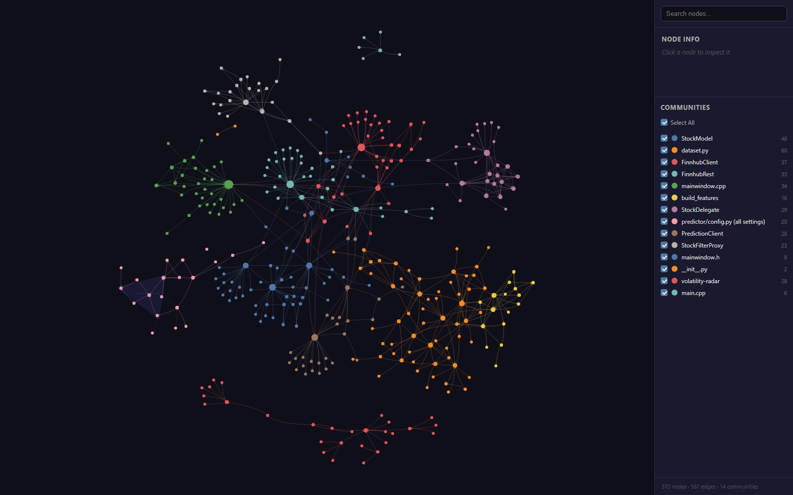

<p align="center"></p>

# volatility-radar

A dark desktop stock screener, inspired by Finviz, built with C++ and Qt 6.
It shows live US stock prices from [Finnhub](https://finnhub.io). An optional
Python model flags which stocks are likely to make an unusually large move in
the next week.

- **Screener table**: sort by any column, search by ticker or name, and filter by sector and price range.
- **Live prices**: streamed over a websocket, with net and % change against the previous close.
- **Stock details panel**, plus a sector distribution chart.
- **Big Move column**: the model's probability of an unusually large move (up *or* down) within 5 trading days.
- **Offline mode**: with no API key, the app loads a bundled snapshot of about 7,000 US listings, so you can try it with no account.

> Not financial advice. The model predicts *volatility*, not direction, and
> its edge is modest (validation AUC around 0.63). Use it to rank stocks worth
> watching, never as a buy/sell signal.

---

## Quick start

### 1. Install the prerequisites

| Tool | Version | Notes |
|------|---------|-------|
| [Qt](https://www.qt.io/download-qt-installer-oss) | 6.5 or newer | In the installer, also tick **Qt Charts** and **Qt WebSockets** (under *Additional Libraries*). |
| C++ compiler | C++17 | MSVC 2022 or MinGW (both ship with the Qt installer on Windows). |
| CMake | 3.19 or newer | Also ships with the Qt installer. |

Developed and tested on Windows 11. The code is portable Qt, so Linux and
macOS should work but are untested.

### 2. Get the code

```bash
git clone https://github.com/Va1Geny/volatility-radar.git
cd volatility-radar/volatility-radar
```

### 3. Build and run

**Easiest: Qt Creator.** Choose *File → Open File or Project*, pick
`volatility-radar/CMakeLists.txt`, select a kit (for example *Desktop Qt 6.x MSVC2022 64bit*),
then press **Run** (Ctrl+R).

**Command line:**

```bash
cmake -S . -B build -DCMAKE_PREFIX_PATH=C:/Qt/6.x.x/msvc2022_64
cmake --build build
```

Replace the `CMAKE_PREFIX_PATH` with your Qt install. To get a standalone
folder you can run or zip, with all the Qt DLLs, install it:

```bash
cmake --install build --prefix dist
```

With no API key the app starts in **offline mode** and shows the bundled snapshot.

---

## Live data (free Finnhub key)

1. Create a free account at <https://finnhub.io/register> and copy your API key.
2. In the `volatility-radar/` folder, copy `.env.example` to a new file named `.env`.
3. Paste your key after the `=`:

   ```
   FINNHUB_API_KEY=your_key_here
   ```

4. Restart the app. The status bar should say **Live: connected to Finnhub**.
   It takes about a minute to load all stocks, because the free plan allows 60 requests per minute.

`.env` is gitignored, so your key never gets committed. You can also set
`FINNHUB_API_KEY` as a normal environment variable instead; it takes priority over `.env`.

The app looks for `.env`, `watchlist.txt`, `stocks.json` and `style.qss` in
the source folder it was built from. If that folder doesn't exist (for example
on another PC), it looks next to the `.exe`.

### Choosing stocks

Live mode tracks the tickers in [`volatility-radar/watchlist.txt`](volatility-radar/watchlist.txt):
one symbol per line, with `#` for comments. The analyzer uses the same file.
Finnhub's free plan streams up to 50 symbols, and each symbol costs 2 API calls at startup.

### What changes in live mode

- The **Volume** and **Industry** columns are hidden, because Finnhub's free plan doesn't provide either.
- **Sector** is Finnhub's industry group (for example *Technology* or *Banking*).
- **Market Cap** shows `-` for foreign listings (such as TSM or TM), because Finnhub reports those in the home currency, not USD.
- Rows don't reorder on every price tick, so they stay put under your cursor.
  To re-sort with fresh prices, click a column header.

---

## Big-move predictions (optional)

The `volatility-radar/analyzer/` folder holds a small Keras model. It scores each
watchlist ticker with P(unusually large move in the next 5 trading days) and
streams the scores to the app's **Big Move** column.

The base rate is about 16%, so a typical stock scores around 16%.
**Amber** (24% and up) means about 1.5× more likely than usual.
**Red** (32% and up) means about 2× more likely than usual.

### Setup (once)

Needs Python 3.10–3.13 (TensorFlow's supported range).

```powershell
cd volatility-radar/analyzer
python -m venv .venv
.\.venv\Scripts\Activate.ps1        # macOS/Linux: source .venv/bin/activate
pip install -r requirements.txt
```

### Train the model (optional)

The repo ships with a trained model, so you can skip straight to the feed.
Retrain to refresh it with newer data, or after you change `watchlist.txt`
or `config.py`:

```powershell
python -m predictor.train --refresh    # downloads ~10 years of daily prices
```

Training runs on the CPU. For the default 41-stock watchlist it takes about
5 minutes, including the download, and it stops early once it stops improving.
The best epoch is saved to `analyzer/artifacts/bigmove_cnn.keras`.

### Run the prediction feed

```powershell
python -m predictor.serve
```

Leave it running and start the app. The status bar should say **Predictions: live**.
The feed re-downloads prices and re-scores every ticker every 30 minutes.
To score a few tickers once from the terminal instead, run `python -m predictor.predict AAPL TSLA`.

To tune the model (thresholds, features, architecture), see
[`analyzer/MODEL_MANUAL.txt`](volatility-radar/analyzer/MODEL_MANUAL.txt).

---

## How it fits together

```
Finnhub REST       (names, quotes at startup) ──┐
Finnhub websocket  (live trades)              ──┼──►  volatility-radar (Qt app)
analyzer/serve.py  (Big Move %, local ws:8765) ─┘
      ▲
      └── yfinance daily prices ──► Keras model
```

## Project layout

```
volatility-radar/
  main.cpp, mainwindow.*     window, layout, wiring
  StockModel.*               table data (one row per stock)
  StockFilterProxy.*         search, sector, price filters and numeric sorting
  StockDelegate.*            cell painting (colored change pills, Big Move badges)
  FinnhubRest.*              startup load: quote and profile per symbol, rate-limited
  FinnhubClient.*            live trade stream (websocket, auto-reconnect)
  PredictionClient.*         reads Big Move scores from the analyzer
  watchlist.txt              tickers for live mode and the model
  stocks.json                offline snapshot (Nasdaq screener export)
  style.qss                  dark theme
  resources/, app.rc         app icon (window, taskbar, .exe)
  .env.example               template for your API key
  analyzer/                  Python model: train, predict, serve
```

## Troubleshooting

| Symptom | Fix |
|---------|-----|
| Status bar says *Offline snapshot* | No key found. Check that `.env` sits in `volatility-radar/` and has `FINNHUB_API_KEY=...` with no spaces around `=`. |
| *Live error: …* or constant reconnects | The key is invalid, or you're over the free plan's limits. The app backs off automatically, up to 60 s between retries. |
| A ticker is missing in live mode | Finnhub returned no quote for it (unknown symbol, or not on the free plan). The status bar shows `SYMBOL: no quote, skipped`. |
| *Predictions: offline* | `python -m predictor.serve` isn't running, or has no trained model yet. |
| App won't start: missing `Qt6*.dll` | Run it from Qt Creator, or use `cmake --install build --prefix dist`, which copies the DLLs. |
| `No model at …` from the analyzer | Train first: `python -m predictor.train`. |

## Contributing (people and AI agents)

- **[AGENTS.md](AGENTS.md)** has the build and test commands, the invariants that must stay in sync, and the house rules.
  Codex and Cursor read it directly; Claude Code loads it through [CLAUDE.md](CLAUDE.md).
- **[graphify-out/](graphify-out/)** is a knowledge graph of the codebase
  ([graphify](https://github.com/safishamsi/graphify)). Agents query it instead of grepping.
  Open `graphify-out/graph.html` in a browser to explore it yourself.

  
- **Keeping the graph current:** install graphify (`uv tool install graphifyy`) and run `graphify hook install` once per clone.
  Git then rebuilds the graph after each commit, and the Claude Code and Cursor hooks refresh it after each edit.

## License and credits

Created by **Valentyn Sarkisov** ([@Va1Geny](https://github.com/Va1Geny)).
Parts of the code were refined with the help of AI coding assistants.

Licensed under the [Apache License 2.0](LICENSE). See [NOTICE](NOTICE).
Market data © Finnhub and Yahoo Finance, subject to their terms of use.
